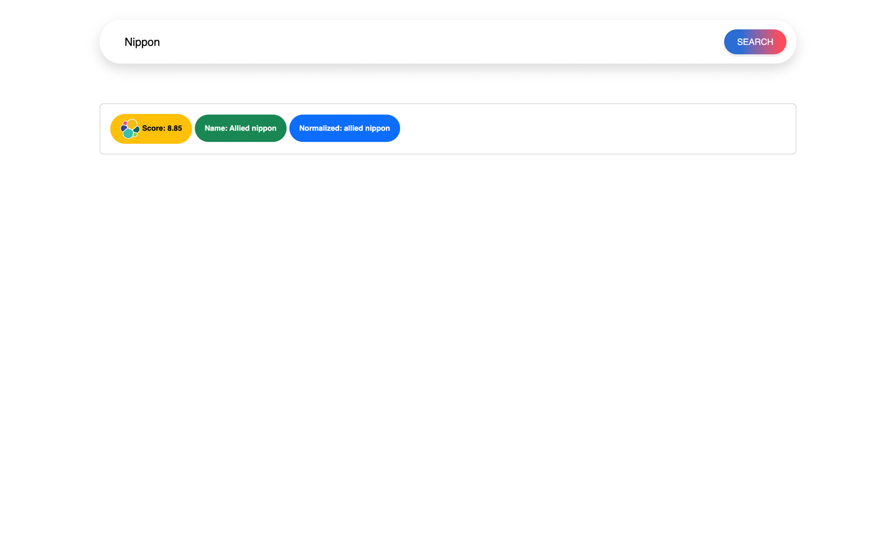

# Company Names Similarity

This is a task for Deep Learning course at ML Engineering magistracy at ITMO.

## Task

It is assumed the One company has Data Base with some information about others companies. Some user wants to add new information, he writes name and wants to get the nearest company name existing in DB or get that this company does not exist yet. The task is to find clusters with company names from DB which is the nearest to input name.

## Data

Data is given dataset with skewness [data](https://drive.google.com/file/d/1e9bdr7wcQX_YBudQcsKj-sMoIGxQOlK4/view?usp=sharing). But data can be expanded by ***Crawler*** from our service.


## Preprocessing

Our preprocessing pipeline includes:

```python
PIPELINE_ORDER = [
    "Spacy",
    "RusStopWordsCleaner",
    "CleancoCleaner",
    "NumbersEliminator",
    "NotWordsEliminator",
    "Unidecoder",
    "Lowercaser",
]
```

## Fuzzywuzzy-based CLF and tuning

We use fuzzywuzzy library to find the nearest company name.
It is based on Levenshtein distance.

We try to tune weights for fuzzy-wuzzy metrics
you can see reports in [tuning](tuning) folder.


## Service (Elastic) architecture

UI:

<details>

Main page:


Search results page:



</details>

We also offer a service with ElasticSearch as a solution.

The high-level architecture of the application is depicted in the diagram.


Includes:
- ElasticSearch - for quickly searching and storing data
- Gateway - service for accessing ElasticSearch from companies, as well as running Crawler
- Crawler is used when there is no data in the database about a given company, it searches in search engines for official sites of these companies and retrieves the necessary information: name and site. And it's important he adds new company to DB
- Redis is used by Gateway to store authorization keys
- Backend - directly service to provide the user interface of the application, frontend is implemented using the Jinja2 template engine and Bootstrap.

**Pipeline:**
- *The user enters the company name*
- *The backend preprocesses the name*
- *Gateway sends a request to the backend, and authorization is checked using an API key*
- *Gateway makes a request to ElasticSearch, if no match is found, Crawler is launched and searches the sites for the necessary information, otherwise results are returned*
- *If it finds something, it preprocesses it, saves it to ElasticSearch and returns the result*

Example for existing name in DB:


Example for not existing name in DB:


Search relevance is highly dependent on the data in the database, but our service is able to learn - to search for new information based on Crawling.

## HOW TO RUN

Turn ON your VPN and write in repo directory
```
docker compose up
```

Go to http://127.0.0.1:8000/ and write any company name

## Code structure

```
├── LICENSE              -- License file
├── Makefile             -- Makefile, not used
├── README.md            -- README file
├── cmnsim               -- Common things, such as preprocessing, clf
├── data                 -- Datasets
├── docker-compose.yml   -- Compose file for services
├── docs                 -- Docs
├── dumps                -- Dumps for ElasticSearch
├── gateway              -- Gateway service, for connecting to ElasticSearch
├── notebooks            -- Notebooks for experiments
├── pyproject.toml       -- Pyproject.toml with linters settings
├── requirements-dev.txt -- Requirements for dev
├── requirements.txt     -- Requirements
├── service              -- Backend service, for end user
├── setup.cfg            -- Other settings for linters
├── tests                -- Tests
└── tuning               -- Tuning sessions
```


## Experiments

The **first** experiment was with FuzzyWuzzy lib. FuzzyWuzzy has several methods to caclulate distance between strings. All string was preprocessed:
* removing stop words by Spacy
* removing russian stop words
* removing all symbols except letters
* making lowercase
We use fuzzy functions to preprocessed strings and add weights near each of them. Minimizing loss we find best relations.

The **second** experiment was using XGBoost with embedings. Each symbol was encoded by number, then XGBoost was trained by encoded dataset. Dataset was balanced.

The **third** and last way is preprocessing from first experiment, then ElasticSearch seaching and storing data. This method returns cluster of company name or nearest in this cluster.

| Model | Metric | Score |
|-------|--------|--------|
| FuzzyWuzzy | F1 | 0.79 |
| Embeded XGBoost | F1 | 0.43 |
| Preprocessed ElasticSearch | [own metric](https://theaidigest.in/how-does-elasticsearch-scoring-work/) | depends on company name cluster |

## Speed

Service wrk output:

Run command:

```bash
wrk -t12 -c400 -d30s http://127.0.0.1:8000/
```

Service with 1 worker, gateway with 5 worker, elastic - 1 shard, 1 replica
Benchmarking was done on Apple M1, 8GB RAM, 8 cores

Output:
```
  12 threads and 400 connections
  Thread Stats   Avg      Stdev     Max   +/- Stdev
    Latency    39.91ms   77.32ms   1.41s    97.90%
    Req/Sec   621.80    291.21     1.77k    67.76%
  221661 requests in 30.10s, 554.69MB read
  Socket errors: connect 155, read 119, write 0, timeout 0
Requests/sec:   7364.00
Transfer/sec:     18.43MB
```

## Code style

We use CI to check code style. There are several checks:

* black
* flack8
* isort
* mypy

Also there are some tests for checking preprocessing.
